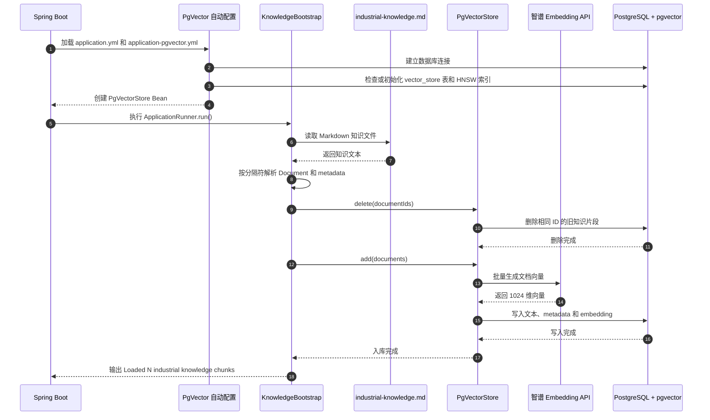
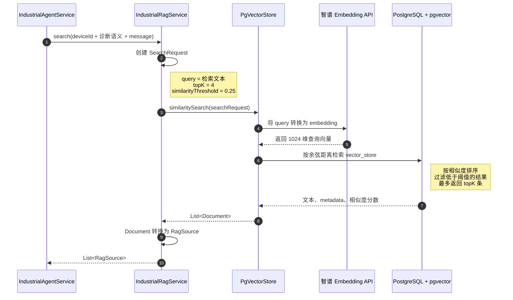
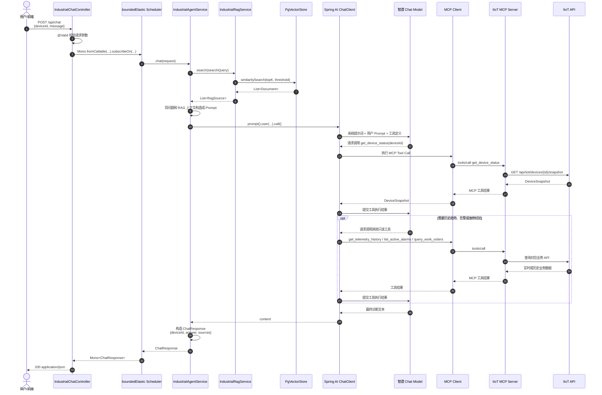
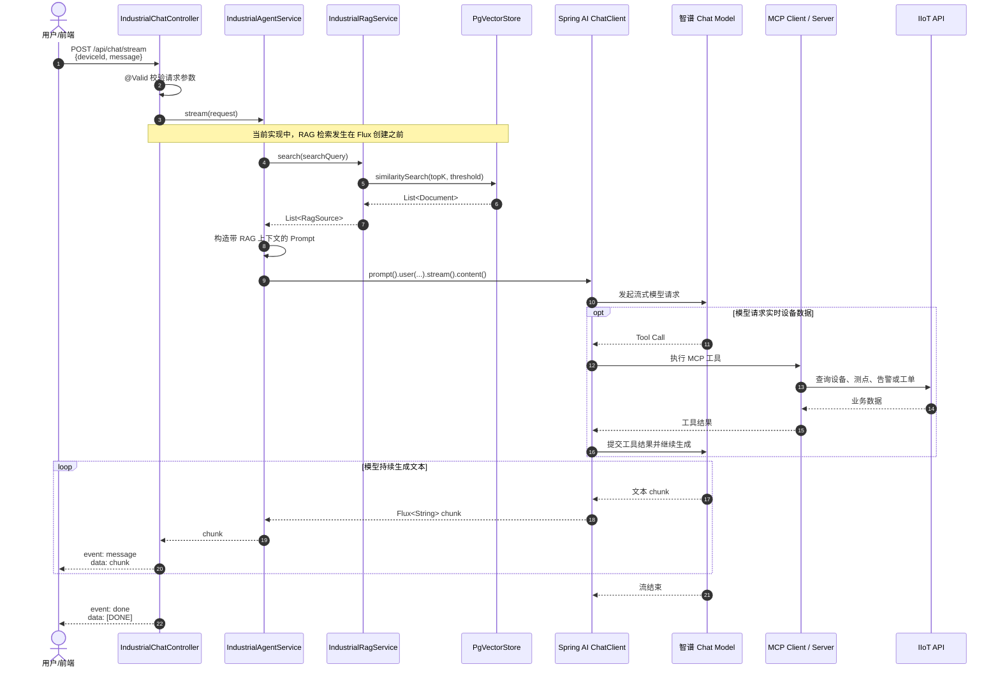

# 工业 AI Agent 时序图

本文档基于当前项目代码，描述知识初始化、向量相似度检索、同步问答和 SSE 流式问答的实际调用过程。

## 1. 核心参与者

| 参与者 | 当前实现 | 职责 |
|---|---|---|
| 客户端 | 浏览器、Postman、curl | 提交设备编号和问题，接收 JSON 或 SSE |
| Chat Controller | `IndustrialChatController` | 参数校验和 HTTP/SSE 响应 |
| Agent Service | `IndustrialAgentService` | 执行 RAG、构造 Prompt、调用模型 |
| RAG Service | `IndustrialRagService` | 构造 `SearchRequest` 并调用 `similaritySearch` |
| Vector Store | Spring AI `PgVectorStore` | 生成查询向量并检索相似文档 |
| Embedding API | 智谱 `embedding-3` | 将文本转换为 1024 维向量 |
| PostgreSQL | PostgreSQL + pgvector | 保存知识向量并执行余弦相似度检索 |
| Chat Model | 智谱 OpenAI-compatible API | 判断是否调用工具并生成诊断回答 |
| MCP Client | Spring AI MCP Client | 将模型的工具调用发送给 MCP Server |
| MCP Server | `iiot-mcp-server` | 暴露只读工业数据工具 |
| IIoT API | 当前为 `iiot-api-server` | 返回设备信息和 push_log 告警统计数据 |

## 2. 应用启动与知识入库

激活 `pgvector` profile 后，Spring AI 创建 `PgVectorStore`。`KnowledgeBootstrap` 在应用启动阶段读取内置 Markdown，将知识片段写入 pgvector。



## 3. `similaritySearch` 检索过程

`similaritySearch` 只负责寻找资料，不负责生成最终回答。



检索结果中的主要信息：

```text
Document
├── id             文档片段唯一标识
├── text           知识片段正文
├── metadata
│   ├── knowledgeId
│   ├── deviceModel
│   ├── documentType
│   └── source
└── score          相似度分数
```

## 4. 非流式 `/api/chat` 时序

接口等待 RAG、工具调用和模型生成全部完成后，一次性返回 `ChatResponse`。



### 为什么使用 `boundedElastic`

`agentService.chat()` 内部的 `similaritySearch()` 和 `ChatClient.call()` 都是同步阻塞调用。Controller 使用 `Mono.fromCallable()` 包装任务，再用 `subscribeOn(Schedulers.boundedElastic())` 将它从 Netty Event Loop 转移到适合阻塞任务的线程池。

## 5. 流式 `/api/chat/stream` 时序

流式接口先完成 RAG 检索，再通过 `ChatClient.stream()` 获取模型输出，并将每个文本片段包装成 SSE `message` 事件。



当前 `/stream` 接口只返回模型文本，不单独返回 RAG `sources`。如果前端需要展示引用来源，建议扩展 SSE 协议：先发送 `sources` 事件，再发送多个 `message` 事件，最后发送 `done` 事件。

## 6. 同步与流式接口对比

| 对比项 | `/api/chat` | `/api/chat/stream` |
|---|---|---|
| HTTP 方法 | POST | POST |
| 响应类型 | `application/json` | `text/event-stream` |
| Reactor 类型 | `Mono<ChatResponse>` | `Flux<ServerSentEvent<String>>` |
| 返回时机 | 完整回答生成后 | 每生成一个文本片段就返回 |
| RAG 来源 | `sources` 字段 | 当前未返回 |
| 结束标志 | HTTP 响应结束 | `event: done`、`data: [DONE]` |

## 7. 当前实现注意事项

1. `/api/chat` 已通过 `boundedElastic` 隔离同步阻塞调用。
2. `/api/chat/stream` 中的 `ragService.search()` 在 `Flux` 创建前同步执行，可能占用 Netty 请求线程；生产环境建议使用 `Mono.fromCallable(...).subscribeOn(boundedElastic)` 包装 RAG 检索后再连接模型流。
3. 当前相似度检索没有使用 metadata 条件过滤；设备型号、工厂或租户需要严格隔离时，应增加 filter expression。
4. Embedding 维度必须与 pgvector 表中的向量维度一致，当前均为 1024。
5. MCP 工具目前全部为只读工具，不会直接启停设备或修改工艺参数。
