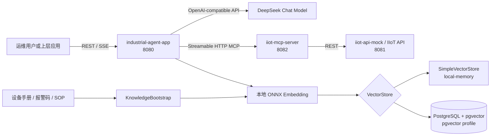
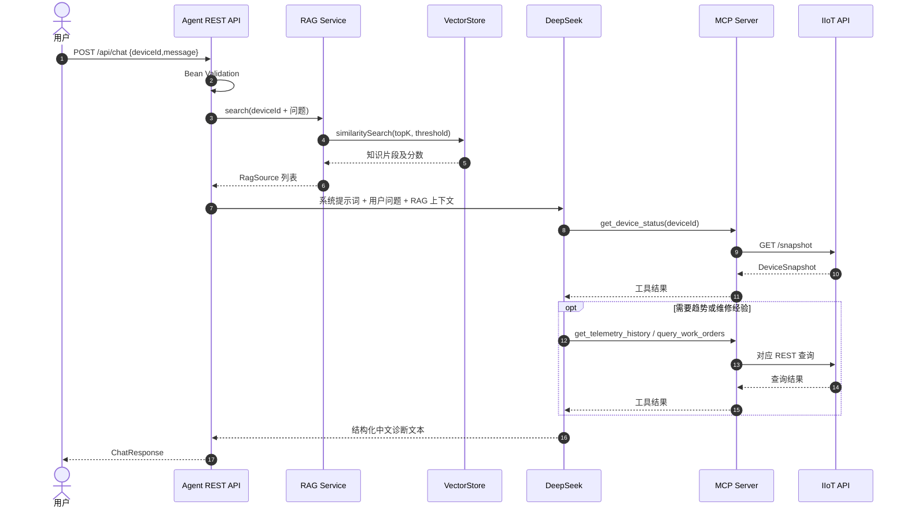
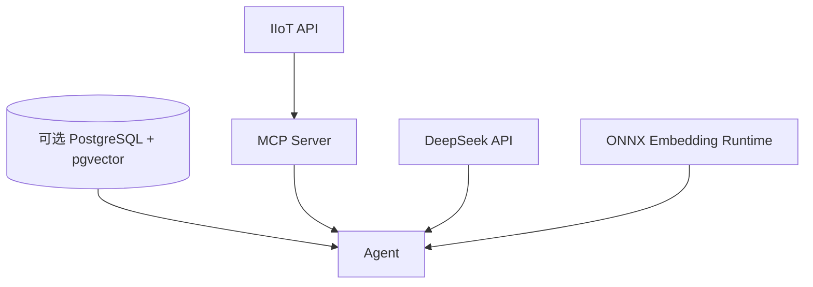

# 工业设备诊断 AI Agent 详细设计方案

## 1. 文档信息

| 项目 | 内容 |
|---|---|
| 项目名称 | Industrial AI Agent Demo |
| 文档类型 | 详细设计方案 |
| 当前版本 | V1.0 |
| 适用范围 | 当前仓库 `industrial-ai-agent-demo` |
| 技术基线 | Java 17、Spring Boot 4.0.5、Spring AI 2.0.1、DeepSeek、MCP、ONNX Embedding、SimpleVectorStore/pgvector |
| 核心场景 | 根据设备编号，联合实时工业数据与内部知识完成只读异常诊断 |

### 1.1 编写目的

本文档描述工业设备诊断 AI Agent 的系统边界、组件职责、接口契约、数据模型、Agent 编排、MCP 工具、RAG 检索、异常处理、安全控制、可观测性、部署运行及测试验收设计，作为后续开发、联调、测试和生产化改造的统一依据。

### 1.2 现状标记规则

- **已实现**：当前仓库已有对应代码或配置。
- **建议完善**：Demo 可运行，但生产化前应补充。
- **规划项**：当前版本不实现，作为后续演进方向。

## 2. 建设目标与边界

### 2.1 建设目标

系统面向设备运维人员提供自然语言诊断能力。用户提交设备编号和问题后，系统应完成以下工作：

1. 通过 MCP 工具读取设备状态、实时测点、活动告警及历史工单。
2. 从内部知识库检索设备手册、报警说明和标准作业程序。
3. 由大模型归纳现象、证据、可能原因、建议步骤、风险和知识来源。
4. 对实时事实、知识依据和模型推断进行明确区分。
5. 全流程保持只读，不直接执行停机、复位、旁路保护或参数下发。

### 2.2 非功能目标

| 目标 | Demo 基线 | 生产建议 |
|---|---|---|
| 可用性 | 单实例、人工启动 | 多实例、健康探针、故障转移 |
| 性能 | 单次问答满足演示 | P95 非流式首包小于 15 秒，流式首字小于 5 秒，具体以模型 SLA 校准 |
| 安全 | MCP 工具只读、提示词约束 | 身份认证、设备级授权、审计、敏感信息脱敏 |
| 可观测性 | Actuator 健康检查和基础日志 | Trace、指标、模型 Token、工具调用和检索命中全链路记录 |
| 可维护性 | Maven 多模块、统一 DTO | API 版本管理、契约测试、配置中心和变更审计 |

### 2.3 系统边界

当前系统负责“查询、检索、分析和建议”，不负责：

- 直接连接 PLC、DCS 或真实 SCADA 执行控制。
- 自动关闭设备、复位告警、修改设定值或旁路安全保护。
- 代替现场人员完成安全评估或维修审批。
- 将模型输出作为唯一故障定论。
- 保存多轮会话状态或用户画像。

## 3. 总体架构设计

### 3.1 逻辑架构



### 3.2 模块划分

| 模块 | 主要职责 | 对外协议 | 当前状态 |
|---|---|---|---|
| `industrial-common` | 统一设备、测点、告警、工单 DTO 与枚举 | Java 模块依赖 | 已实现 |
| `iiot-api-mock` | 提供三台演示设备的状态、测点、告警和工单 REST API | HTTP/JSON，8081 | 已实现 |
| `iiot-mcp-server` | 将 IIoT REST API 封装为只读 MCP 工具 | Streamable HTTP MCP，8082 | 已实现 |
| `industrial-agent-app` | 输入校验、RAG 检索、模型推理、MCP 工具调用、同步和流式输出 | HTTP/JSON、SSE，8080 | 已实现 |
| `infra/postgresql` | pgvector 扩展初始化 | SQL | 已实现基础脚本 |

### 3.3 关键设计原则

1. **实时数据与知识解耦**：设备当前状态只能来自 MCP 工具，手册和 SOP 只能作为诊断依据。
2. **最小权限**：P0 阶段所有 MCP 工具均为只读、幂等、非破坏性工具。
3. **证据优先**：回答中必须携带关键数值、知识来源以及不确定性说明。
4. **模型可替换**：通过 OpenAI-compatible 接口隔离具体对话模型供应商。
5. **向量库可切换**：使用 Spring Profile 在内存向量库和 pgvector 之间切换。
6. **契约稳定**：IIoT API、MCP 工具与公共 DTO 分层，避免模型层直接依赖数据源细节。

## 4. 核心业务流程

### 4.1 同步诊断时序



### 4.2 流式诊断时序

流式接口在 RAG 检索完成后调用模型流式输出，并以 SSE `message` 事件逐块返回内容，最后发送 `done` 事件，数据为 `[DONE]`。当前流式返回只包含模型文本，不单独返回 `sources` 字段；调用方如需结构化来源，应使用同步接口或后续扩展 SSE 事件类型。

### 4.3 关键决策点

| 决策 | 规则 |
|---|---|
| 是否允许回答当前设备状态 | 必须成功调用 MCP 获取数据，否则只能说明数据不可用 |
| 是否查询历史趋势 | 用户询问趋势、异常持续性，或最新值不足以判断时调用 |
| 是否查询维修工单 | 用户询问历史原因、复发问题、处置经验时调用 |
| RAG 无命中 | 明确提示未找到内部知识，不得虚构阈值和 SOP |
| 实时数据与知识冲突 | 以实时数据描述现状，以手册阈值作为参考，并明确冲突 |
| 是否建议控制操作 | 可以提出建议，但必须注明由现场授权人员确认并执行 |

## 5. 领域数据模型设计

所有时间字段使用 ISO-8601 UTC 时间，由 Java `Instant` 表示；设备编号采用 `DEV-` 加三位数字。

### 5.1 Device

| 字段 | 类型 | 说明 | 示例 |
|---|---|---|---|
| `id` | String | 设备唯一编号 | `DEV-001` |
| `name` | String | 设备名称 | 一号主轴电机 |
| `model` | String | 设备型号 | `MTR-X200` |
| `location` | String | 物理位置 | 一号车间/产线A |
| `status` | Enum | `RUNNING/WARNING/STOPPED/OFFLINE` | `WARNING` |
| `updatedAt` | Instant | 状态更新时间 | `2026-08-27T06:00:00Z` |

### 5.2 Telemetry

| 字段 | 类型 | 单位/约束 | 说明 |
|---|---|---|---|
| `deviceId` | String | `DEV-\d{3}` | 所属设备 |
| `timestamp` | Instant | UTC | 采集时间 |
| `temperatureCelsius` | double | °C | 温度 |
| `vibrationMmPerSecond` | double | mm/s | 振动速度 |
| `speedRpm` | double | rpm | 转速 |
| `currentAmpere` | double | A | 电流 |

生产化时建议将固定测点字段改为通用测点模型 `pointCode/value/unit/quality/timestamp`，并增加数据质量码，避免设备类型扩展时频繁修改公共 DTO。

### 5.3 Alarm

| 字段 | 类型 | 说明 |
|---|---|---|
| `id` | String | 告警编号 |
| `deviceId` | String | 设备编号 |
| `code` | String | 告警码 |
| `severity` | Enum | `INFO/WARNING/CRITICAL` |
| `message` | String | 告警说明 |
| `active` | boolean | 是否仍处于活动状态 |
| `occurredAt` | Instant | 发生时间 |

### 5.4 WorkOrder

| 字段 | 类型 | 说明 |
|---|---|---|
| `id` | String | 工单编号 |
| `deviceId` | String | 设备编号 |
| `status` | String | 工单状态，当前 Demo 使用字符串 |
| `description` | String | 故障或任务描述 |
| `resolution` | String | 处置结果 |
| `createdAt` | Instant | 创建时间 |

生产化时应将 `status` 收敛为枚举，并补充关闭时间、责任班组、故障分类、备件及验证结果。

### 5.5 DeviceSnapshot

`DeviceSnapshot` 是设备诊断的聚合读模型，由 `device`、`telemetry` 和 `activeAlarms` 组成。该模型用于一次请求获取最小诊断上下文，减少模型多次调用工具的次数。

### 5.6 RAG 文档模型

| 字段 | 说明 |
|---|---|
| `id` | 稳定的知识片段编号，用于幂等覆盖 |
| `text` | 知识正文 |
| `deviceModel` | 适用设备型号，通用知识使用 `ALL` |
| `documentType` | `alarm-guide`、`sop`、`safety-policy` 等 |
| `source` | 对用户展示的来源名称 |
| `score` | 检索阶段返回的相关度分数，不持久化到源文档 |

生产化建议增加 `factoryId`、`documentVersion`、`effectiveFrom`、`effectiveTo`、`securityLevel`、`language`、`checksum` 和原文定位信息。

## 6. IIoT REST API 详细设计

基础路径为 `/api/iiot`，当前版本均为 GET 只读接口。

| 接口 | 参数 | 返回 | 用途 |
|---|---|---|---|
| `GET /devices` | 无 | `List<Device>` | 查询设备列表 |
| `GET /devices/{deviceId}` | 路径参数 | `Device` | 查询设备详情 |
| `GET /devices/{deviceId}/snapshot` | 路径参数 | `DeviceSnapshot` | 查询诊断聚合快照 |
| `GET /devices/{deviceId}/telemetry/latest` | 路径参数 | `Telemetry` | 查询最新测点 |
| `GET /devices/{deviceId}/telemetry/history` | `limit`，默认 12，范围 1～60 | `List<Telemetry>` | 查询 5 分钟间隔历史数据 |
| `GET /devices/{deviceId}/alarms` | `activeOnly`，默认 true | `List<Alarm>` | 查询告警 |
| `GET /devices/{deviceId}/work-orders` | 路径参数 | `List<WorkOrder>` | 查询维修工单 |

### 6.1 示例响应

```json
{
  "device": {
    "id": "DEV-001",
    "name": "一号主轴电机",
    "model": "MTR-X200",
    "location": "一号车间/产线A",
    "status": "WARNING",
    "updatedAt": "2026-08-27T06:00:00Z"
  },
  "telemetry": {
    "deviceId": "DEV-001",
    "timestamp": "2026-08-27T06:00:00Z",
    "temperatureCelsius": 86.4,
    "vibrationMmPerSecond": 8.7,
    "speedRpm": 1482.0,
    "currentAmpere": 31.6
  },
  "activeAlarms": [
    {
      "id": "ALM-1001",
      "deviceId": "DEV-001",
      "code": "MTR-TEMP-HIGH",
      "severity": "CRITICAL",
      "message": "主轴电机轴承温度超过 85°C",
      "active": true,
      "occurredAt": "2026-08-27T05:52:00Z"
    }
  ]
}
```

### 6.2 REST 异常契约

当前设备不存在时返回 HTTP 404。生产化建议统一为 Problem Details 格式：

```json
{
  "type": "urn:industrial-ai:error:device-not-found",
  "title": "Device not found",
  "status": 404,
  "detail": "Device DEV-999 does not exist",
  "traceId": "..."
}
```

建议状态码：参数格式错误返回 400，未认证返回 401，无设备权限返回 403，上游数据源超时返回 504，上游不可用返回 503。

## 7. MCP Server 详细设计

### 7.1 连接设计

- 服务端口：`8082`。
- 协议：MCP Streamable HTTP。
- 服务名称：`iiot-readonly-tools`。
- 服务类型：同步工具服务。
- 上游地址：`IIOT_API_BASE_URL`，默认 `http://localhost:8081`。
- MCP Server 通过 `RestClient` 访问 IIoT API，并附带 `X-Client-Name: iiot-mcp-server`。

### 7.2 工具清单

| 工具名 | 输入 | 输出 | 使用场景 |
|---|---|---|---|
| `list_devices` | 无 | `List<Device>` | 用户未给出有效设备编号时辅助确认 |
| `get_device_status` | `deviceId` | `DeviceSnapshot` | 诊断时优先调用 |
| `get_latest_telemetry` | `deviceId` | `Telemetry` | 仅需最新测点时调用 |
| `get_telemetry_history` | `deviceId`, `limit` | `List<Telemetry>` | 分析趋势，limit 被限制在 1～60 |
| `list_active_alarms` | `deviceId` | `List<Alarm>` | 单独核对活动告警 |
| `query_work_orders` | `deviceId` | `List<WorkOrder>` | 查找类似故障和既往处置 |

所有工具元数据均声明：

- `readOnlyHint = true`
- `destructiveHint = false`
- `idempotentHint = true`
- `openWorldHint = false`

### 7.3 输入校验

设备编号必须匹配 `DEV-\d{3}`，再统一转换为大写。当前控制器层也使用相同正则校验。生产化建议将设备编号校验抽取到公共值对象或校验器，避免两端规则漂移。

### 7.4 工具错误处理建议

| 场景 | MCP 返回策略 | Agent 行为 |
|---|---|---|
| 设备编号非法 | 明确的参数错误 | 提示用户修正编号，不继续推断 |
| 设备不存在 | 映射为业务错误 | 说明未找到设备 |
| IIoT 超时 | 工具暂时不可用 | 返回已获得的信息并提示实时数据缺失 |
| IIoT 5xx | 保留 traceId，隐藏内部堆栈 | 不得将知识库内容表述为实时状态 |
| 返回空列表 | 正常结果 | 明确“当前未查询到告警/工单” |

## 8. Agent 应用详细设计

### 8.1 输入输出接口

#### 同步接口

`POST /api/chat`，请求体：

```json
{
  "deviceId": "DEV-001",
  "message": "分析当前温度和振动异常，并给出处置建议"
}
```

校验规则：`deviceId` 非空且匹配 `DEV-\d{3}`；`message` 非空。

响应体：

```json
{
  "deviceId": "DEV-001",
  "answer": "模型生成的结构化诊断文本",
  "sources": [
    {
      "id": "mtr-x200-temp",
      "text": "...",
      "source": "MTR-X200 报警码手册 3.2 节",
      "deviceModel": "MTR-X200",
      "documentType": "alarm-guide",
      "score": 0.82
    }
  ]
}
```

#### 流式接口

`POST /api/chat/stream`，请求体与同步接口相同，响应类型为 `text/event-stream`：

```text
event:message
data:现象：...

event:done
data:[DONE]
```

### 8.2 提示词设计

系统提示词承担稳定的全局约束：

1. 强制使用简体中文。
2. 查询当前状态时必须调用 MCP，不得猜测。
3. 区分实时事实、知识依据和推断。
4. 固定输出为“现象、实时数据、诊断判断、建议步骤、风险与限制、知识来源”。
5. 信息不足时明确说明，不编造告警、阈值和工单。
6. 明确只有只读权限，控制动作必须由现场授权人员执行。

用户提示词由设备编号、用户问题、RAG 上下文和工具调用建议组成。RAG 上下文属于不可信输入，生产化时应增加提示注入隔离规则：知识内容不得覆盖系统指令，不得触发写操作，不得泄露密钥或内部配置。

### 8.3 Agent 编排策略

当前实现采用“应用先检索 RAG，再由模型决定 MCP 工具调用”的编排方式：

```text
请求校验
  -> 构造检索词
  -> RAG Top-K 检索
  -> 拼接知识上下文
  -> 调用 ChatClient
  -> 模型调用 MCP 工具
  -> 生成最终回答
  -> 返回答案和来源
```

这种方式结构简单，适合 Demo。生产化建议增加显式编排状态：

- `VALIDATED`：请求已通过校验。
- `KNOWLEDGE_RETRIEVED`：知识检索完成。
- `REALTIME_DATA_ACQUIRED`：至少一次设备状态工具调用成功。
- `DIAGNOSIS_GENERATED`：模型已生成诊断。
- `SAFETY_CHECKED`：输出通过安全规则检查。
- `COMPLETED/DEGRADED/FAILED`：最终状态。

### 8.4 回答质量规则

最终答案至少包含：

- 设备当前状态和数据时间戳。
- 关键测点数值及单位。
- 活动告警编号、级别和发生时间。
- 诊断判断及其证据，不将可能性写成确定事实。
- 从低风险检查到高风险操作的有序建议。
- 数据时效性、缺失数据和模型能力边界。
- 可读的知识来源名称。

## 9. RAG 详细设计

### 9.1 知识入库流程


知识段头格式为：

```text
## DOC:<id>|<deviceModel>|<documentType>|<source>
```

应用启动时，`KnowledgeBootstrap` 读取类路径知识文件，解析文档，按稳定 ID 先删除旧记录再写入新记录，实现 Demo 级幂等更新。

### 9.2 检索设计

- 查询文本：`设备编号 + “工业设备异常诊断” + 用户问题`。
- 默认返回条数：`topK = 4`。
- 默认相似度阈值：`0.25`。
- 返回信息：文档 ID、正文、来源、设备型号、文档类型和分数。
- 无结果：返回空列表，并在提示词中写入“未检索到相关知识片段”。

### 9.3 向量存储策略

| Profile | 存储实现 | 特点 | 适用场景 |
|---|---|---|---|
| `local-memory` | `SimpleVectorStore` | 无外部数据库，重启后重建 | 本地演示、快速联调 |
| `pgvector` | PostgreSQL pgvector | 持久化、HNSW、余弦距离、384 维 | 集成测试、准生产环境 |

`pgvector` profile 当前配置 `initialize-schema=true`、`HNSW`、`COSINE_DISTANCE`、384 维、单批最大 100 条。Embedding 模型输出维度必须始终与数据库向量维度一致。

### 9.4 生产化检索优化

1. 从设备信息获取 `deviceModel`，增加 `deviceModel in (当前型号, ALL)` 元数据过滤。
2. 对标题、告警码等精确字段增加关键词检索，形成混合检索。
3. 使用重排序模型对向量召回结果二次排序。
4. 对低分结果、重复段落和失效版本进行过滤。
5. 保存原文页码、章节、文档版本和生效时间，支持可追溯引用。
6. 以 checksum 判断内容是否变化，避免每次启动全量重嵌入。

## 10. 配置设计

### 10.1 环境变量

| 环境变量 | 默认值 | 所属服务 | 说明 |
|---|---|---|---|
| `AGENT_APP_PORT` | `8080` | Agent | Agent HTTP 端口 |
| `IIOT_API_PORT` | `8081` | IIoT | IIoT API 端口 |
| `MCP_SERVER_PORT` | `8082` | MCP | MCP Server 端口 |
| `DEEPSEEK_BASE_URL` | `https://api.deepseek.com` | Agent | 模型服务地址 |
| `DEEPSEEK_API_KEY` | `not-configured` | Agent | 模型密钥，运行问答前必须配置 |
| `DEEPSEEK_MODEL` | `deepseek-v4-flash` | Agent | 对话模型名称 |
| `MCP_SERVER_BASE_URL` | `http://localhost:8082` | Agent | MCP Server 地址 |
| `IIOT_API_BASE_URL` | `http://localhost:8081` | MCP | IIoT API 地址 |
| `PGVECTOR_URL` | `jdbc:postgresql://localhost:5432/industrial_ai` | Agent | pgvector JDBC 地址 |
| `PGVECTOR_USERNAME` | `postgres` | Agent | 数据库用户名 |
| `PGVECTOR_PASSWORD` | `postgres` | Agent | 数据库密码 |
| `RAG_TOP_K` | `4` | Agent | 最大召回数量 |
| `RAG_SIMILARITY_THRESHOLD` | `0.25` | Agent | 最低相似度 |

### 10.2 密钥管理

密钥不得提交到仓库、打印到日志或透传到模型提示词。生产环境应通过操作系统密钥存储或企业密钥管理服务注入，并支持定期轮换。应用启动时若检测到 `DEEPSEEK_API_KEY=not-configured`，建议直接将问答能力标记为未就绪，而不是等到请求阶段失败。

## 11. 异常处理与降级设计

### 11.1 异常分类

| 分类 | 示例 | 处理策略 |
|---|---|---|
| 输入异常 | 设备编号或问题为空 | 400，返回字段级错误 |
| 模型异常 | 超时、限流、鉴权失败 | 有限重试；失败后返回可诊断错误，不返回堆栈 |
| MCP 异常 | 握手失败、工具超时 | 标记实时数据不可用，禁止给出确定性当前状态 |
| IIoT 异常 | 设备不存在、数据源离线 | 映射标准业务错误，保留 traceId |
| RAG 异常 | 无命中、向量库不可用 | 无命中正常降级；不可用时仅基于实时数据回答并声明缺失 |
| Embedding 异常 | ONNX 原生库加载失败 | 健康检查不就绪，禁止接收诊断请求 |
| 输出异常 | 模型内容为空或违反安全规则 | 进行输出校验，必要时返回安全兜底响应 |

### 11.2 超时与重试

- MCP 请求当前超时为 20 秒。
- 只对幂等读操作进行有限重试，建议最多 2 次并使用指数退避和随机抖动。
- 模型限流应尊重服务端 `Retry-After`。
- 用户主动取消 SSE 连接时，应向下游传播取消信号，避免继续消耗模型 Token。
- 整体请求应设置总预算，避免模型重试、工具重试层层叠加造成超长等待。

### 11.3 降级回答模板

当实时数据不可用时，回答应明确：

```text
当前无法从设备数据源取得 DEV-001 的实时状态，因此不能确认设备当前是否异常。
已检索到的手册/SOP 只能作为一般排查参考，不代表该设备的实时诊断结果。
建议检查 IIoT 数据链路后重新发起诊断。
```

## 12. 安全设计

### 12.1 权限边界

当前 MCP Server 只注册读取类工具。任何后续写工具必须进入独立服务或独立工具集合，默认禁用，并至少具备：身份认证、设备级授权、参数白名单、双人或二次确认、操作前置条件校验、幂等键、完整审计及紧急熔断。

### 12.2 防提示注入

- 系统指令优先级高于用户输入、知识文档和工具结果。
- 将检索文档和工具结果标记为“数据”，不得作为指令执行。
- 拒绝用户要求泄露系统提示词、密钥、连接串或内部日志。
- 对知识文件建立可信来源、版本审批和内容校验机制。
- 限制模型可见工具集合，避免动态暴露未知写工具。

### 12.3 数据安全

- 日志中不记录 API Key、数据库密码、完整个人信息和敏感工艺参数。
- 生产环境内部链路使用 TLS；服务间采用双向认证或工作负载身份。
- 设备数据按工厂、产线和设备授权隔离。
- 对问答记录、工具参数和模型输出定义保留周期和删除策略。

## 13. 可观测性设计

### 13.1 日志

每个请求生成统一 `traceId`，结构化记录：

- 请求入口、设备编号哈希或脱敏值、接口类型。
- RAG 查询耗时、Top-K、命中文档 ID 和分数。
- MCP 工具名称、参数摘要、耗时、结果数量和状态。
- 模型名称、首 Token 延迟、总耗时、输入/输出 Token 和结束原因。
- 异常类型、上游状态码和重试次数。

不得记录模型密钥、数据库密码、完整系统提示词或未经脱敏的敏感业务数据。

### 13.2 指标

建议指标包括：

- `agent_requests_total{endpoint,status}`
- `agent_request_duration_seconds`
- `llm_first_token_duration_seconds`
- `llm_tokens_total{direction,model}`
- `mcp_tool_calls_total{tool,status}`
- `mcp_tool_duration_seconds{tool}`
- `rag_search_duration_seconds`
- `rag_hits_count`
- `upstream_errors_total{upstream,type}`

### 13.3 健康检查

三个服务均暴露 `/actuator/health`。生产化建议区分：

- Liveness：进程和事件循环是否正常，不依赖外部服务。
- Readiness：MCP 连接、模型凭据、Embedding 模型和向量库是否可用。
- Dependency health：IIoT、MCP、数据库和模型服务分别报告，避免只返回笼统的 DOWN。

## 14. 部署与运行设计

### 14.1 本地启动拓扑

无需容器编排。服务启动顺序为：

1. `iiot-api-mock`，确认 8081 健康。
2. `iiot-mcp-server`，确认 8082 健康并能访问 IIoT API。
3. 设置 `DEEPSEEK_API_KEY`，启动 `industrial-agent-app`，确认 8080 健康。
4. 使用 `local-memory` 时无需数据库；使用 `pgvector` 时应先准备 PostgreSQL 数据库并执行 `infra/postgresql/init.sql`。

### 14.2 进程参数建议

- 显式设置 JVM 初始/最大堆、UTF-8 编码和时区。
- ONNX 原生库需要与操作系统架构匹配，并具备相应 VC++ Runtime。
- 为每个服务使用独立日志文件、PID 管理和停止脚本。
- 生产环境禁止使用默认数据库密码和 `not-configured` 模型密钥。

### 14.3 启停与依赖关系



Agent 应在依赖未就绪时保持 Readiness 失败；停止时先停止接收新请求，等待进行中的 SSE 请求结束或达到优雅停机超时，再关闭 MCP、模型和数据库连接。

## 15. 性能与容量设计

### 15.1 主要耗时构成

总耗时近似为：RAG Embedding + 向量检索 + 模型首轮推理 + MCP 工具调用 + 模型最终生成。模型推理通常是主要瓶颈，工具调用次数对延迟也有直接影响。

### 15.2 优化策略

- 优先调用一次 `get_device_status` 获取聚合数据，减少重复工具调用。
- 对不随请求变化的知识 Embedding 做持久化和增量更新。
- 限制历史测点最多 60 条、RAG Top-K 默认 4 条，控制提示词大小。
- 对设备元数据等短周期稳定信息使用有界缓存；实时测点不做长时间缓存。
- 设置模型最大输出长度和整体请求超时。
- 流式接口使用背压和连接数限制，防止慢客户端占用资源。

### 15.3 容量评估方法

生产上线前应根据峰值并发、平均工具调用次数、平均输入/输出 Token、模型速率限制和 SSE 平均连接时长进行压测。容量规划不得只依据 HTTP QPS，还要同时考虑外部模型配额、数据库连接池和 MCP 上游并发上限。

## 16. 测试设计

### 16.1 单元测试

- 设备编号格式校验及大小写标准化。
- 历史测点 `limit` 的 1～60 边界。
- 告警活动状态过滤。
- 知识文档分段、非法头格式和元数据解析。
- RAG 空结果和来源渲染。
- Prompt 构造不遗漏设备编号、问题和知识来源。

### 16.2 契约与集成测试

- IIoT API 响应与 `industrial-common` DTO 契约一致。
- 六个 MCP 工具的输入、输出 Schema 和只读 annotations 正确。
- MCP Server 对 404、超时和 5xx 的映射符合约定。
- `local-memory` 与 `pgvector` 两种 profile 均可完成知识入库和检索。
- 同步问答返回 `answer` 和 `sources`；流式问答以 `[DONE]` 正常结束。

### 16.3 端到端测试场景

| 场景 | 设备 | 预期重点 |
|---|---|---|
| 温度与振动同时异常 | `DEV-001` | 获取 CRITICAL/WARNING 告警，引用 MTR-X200 手册和 SOP，不直接声称已停机 |
| 正常设备查询 | `DEV-002` | 不制造告警，明确当前测点正常范围需以适用手册为准 |
| 空压机振动异常 | `DEV-003` | 获取历史趋势和开放工单，建议频谱分析及联轴器检查 |
| 非法设备编号 | `ABC-1` | HTTP 400，不调用模型和工具 |
| 不存在设备 | `DEV-999` | 明确设备不存在，不生成伪造诊断 |
| MCP 不可用 | 任意 | 声明实时数据缺失，不把 RAG 文档当实时事实 |
| RAG 无命中 | 任意 | 可基于实时数据描述，但不得编造手册阈值 |
| 模型超时 | 任意 | 返回标准错误和 traceId，不泄露内部异常 |

### 16.4 安全测试

- 用户要求模型执行停机、复位或修改参数时必须拒绝执行。
- 用户尝试覆盖系统提示词时，不得绕过只读边界。
- 恶意知识文档中的指令不得触发工具滥用。
- 日志和错误响应不得出现 API Key、数据库密码和系统提示词。

## 17. 验收标准

系统满足以下条件可视为 Demo 详细设计目标达成：

1. 三个服务按 8081、8082、8080 顺序启动且健康检查通过。
2. 输入 `DEV-001` 和异常诊断问题后，Agent 至少调用 `get_device_status`。
3. 回答包含实时温度、振动、告警、诊断建议、风险说明和知识来源。
4. RAG 来源与知识文件中的设备型号和文档类型一致。
5. 同步接口返回结构化来源，流式接口正确发送结束事件。
6. 对无设备、MCP 不可用、RAG 无命中和模型失败给出可理解的错误或降级结果。
7. 系统不暴露任何控制类 MCP 工具，不声称已执行现场操作。

## 18. 已知限制与演进路线

### 18.1 当前已知限制

- IIoT 数据为内存 Mock，时间和值固定，不代表真实现场数据质量。
- 知识文件为少量预分段 Markdown，未实现通用文档解析和版本审批。
- RAG 未按设备型号做强制过滤，也没有关键词混合检索和重排序。
- 同步响应未返回 MCP 工具调用明细；流式响应未结构化返回来源。
- 未实现统一异常响应、用户认证、设备授权、审计和分布式追踪。
- 本地 ONNX Runtime 对操作系统原生运行库和 CPU 架构存在依赖。
- Agent 调用过程未显式限制最大工具轮次和总 Token 预算。

### 18.2 演进优先级

| 优先级 | 事项 |
|---|---|
| P0 | 统一错误响应、依赖 Readiness、模型/MCP 总超时、最大工具轮次 |
| P0 | 将设备型号带入 RAG 元数据过滤，提升召回准确率 |
| P0 | 增加端到端测试和 MCP 契约测试 |
| P1 | 增加身份认证、设备级授权、操作审计和敏感数据脱敏 |
| P1 | 持久化知识版本，支持增量入库、文档定位和混合检索 |
| P1 | 输出工具调用证据、Token 使用和全链路 Trace |
| P2 | 引入人工反馈、诊断评测集和答案质量自动评估 |
| P2 | 在独立安全域内评估受控写操作，默认继续关闭 |

## 19. 设计结论

当前工程采用“Spring AI Agent + DeepSeek 推理 + MCP 实时只读工具 + RAG 内部知识”的分层方案，边界清晰，适合作为工业设备异常诊断 Demo。详细设计的核心是保证两类证据来源不混淆：设备现状必须来源于 MCP 实时查询，诊断阈值和处置步骤来源于经过管理的知识库；模型仅负责工具选择、证据归纳和自然语言表达。生产化工作的优先顺序应是可靠性与安全边界，其次是检索质量和可观测性，最后才是控制类能力扩展。
