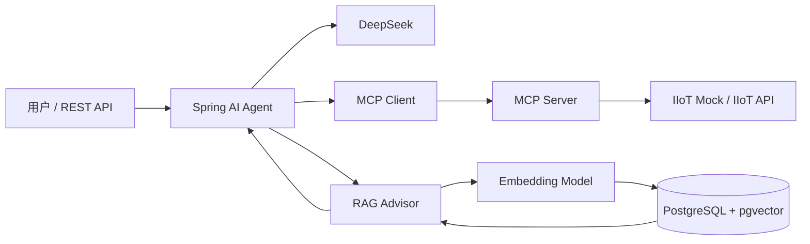

# 工业 AI Agent 技术架构与 Demo 工程任务清单

## 1. Demo 目标

以“设备异常诊断助手”为主场景：用户输入设备编号和问题，Agent 自动查询设备实时状态、测点、告警和维修记录，同时检索设备手册、报警码及 SOP，最后输出异常原因、处理建议和证据来源。

## 2. 总体架构

> MCP 工具调用与 RAG 检索是 Spring AI Agent 的两条并行能力，不是完全串行关系。



## 3. P0：可运行 Demo

- [ ] **T01：确定演示场景**
  - 输入设备编号和自然语言问题。
  - Agent 查询实时状态、活动告警和维修知识。
  - 输出异常原因、诊断依据及处理建议。

- [ ] **T02：绘制技术架构**
  - 输出组件架构图。
  - 输出调用时序图。
  - 输出部署图和知识入库流程图。

- [ ] **T03：定义工程结构**
  - 建立 Maven 多模块工程。
  - 建议模块：`industrial-agent-app`、`iiot-mcp-server`、`iiot-api-mock`、`infra`、`sample-data`。

- [ ] **T04：搭建本地调试环境**
  - 准备本地 JDK、Maven、PostgreSQL 和 pgvector 扩展。
  - 提供 `application-local.yml` 和 `.env.example`，统一管理端口、API Key、数据库密码和服务地址。
  - IIoT Mock、MCP Server 和 Agent 应用分别通过 Maven 命令在本地启动。
  - 固定各服务的本地端口，并提供启动顺序和健康检查地址。

- [ ] **T05：实现 IIoT Mock API**
  - 设备列表和设备详情。
  - 设备实时状态和最新测点。
  - 历史趋势数据。
  - 活动告警和历史告警。
  - 维修工单查询。

- [ ] **T06：设计统一工业数据模型**
  - 定义 `Device`、`Telemetry`、`Alarm`、`WorkOrder`、`KnowledgeDocument` 等 DTO。
  - 统一设备编码、时间格式、测点单位和状态枚举。

- [ ] **T07：实现 MCP Server**
  - 将 IIoT API 封装为 MCP Tools。
  - 首批工具：`get_device_status`、`get_latest_telemetry`、`list_active_alarms`、`query_work_orders`。
  - 为每个工具定义明确的输入、输出 JSON Schema 和错误码。

- [ ] **T08：接入 MCP Client**
  - Spring AI Agent 自动发现 MCP Tools。
  - 使用 Streamable HTTP 连接 MCP Server。
  - 配置连接超时、工具过滤和失败降级。

- [ ] **T09：接入 DeepSeek**
  - 配置 OpenAI-compatible Base URL、API Key 和模型名称。
  - 配置超时、重试、流式输出和 Tool Calling。
  - 验证普通对话、结构化输出和 MCP 工具调用。

- [ ] **T10：确定 Embedding 方案**
  - DeepSeek 负责对话推理与工具选择。
  - Demo 默认使用 Spring AI 本地 ONNX Transformer 生成 Embedding。
  - 固定向量维度，确保与 pgvector 表结构一致。

- [ ] **T11：初始化 pgvector**
  - 启用 `vector` 扩展。
  - 创建知识文档、分片、元数据和向量字段。
  - 创建余弦距离 HNSW 索引。
  - 提供数据库初始化和迁移脚本。

- [ ] **T12：实现知识入库**
  - 导入设备手册、报警码、SOP 和维修案例。
  - 实现解析、清洗、切片、Embedding、去重和写入。
  - 保存设备型号、工厂、文档类型、版本和来源等元数据。

- [ ] **T13：实现 RAG 检索**
  - 根据用户问题生成查询向量。
  - 支持设备型号、工厂和文档类型等元数据过滤。
  - 返回 Top-K 文档片段、相似度和来源。
  - 处理无结果、低相关度和重复片段。

- [ ] **T14：实现 Agent 编排**
  - 配置工业诊断系统提示词。
  - 集成 RAG Advisor 和 MCP Tool Callback。
  - 限制最大工具调用次数和单次响应时间。
  - 统一最终答案结构：现象、实时数据、诊断、建议、风险和来源。

- [ ] **T15：提供问答接口**
  - 实现 `POST /api/chat`。
  - 实现流式问答接口。
  - 返回答案、工具调用记录、设备数据和知识来源。

- [ ] **T16：准备演示数据**
  - 至少准备三台设备。
  - 覆盖正常、温度过高和振动异常场景。
  - 准备对应告警、历史测点、维修工单、设备手册和 SOP。

## 4. P1：工业安全与工程质量

- [ ] **T17：工业操作安全**
  - P0 MCP 工具全部只读。
  - 启停机、复位和参数下发等写操作默认关闭。
  - 后续启用写操作时增加二次确认、权限校验、参数白名单和审计日志。

- [ ] **T18：异常与降级处理**
  - 覆盖 DeepSeek 超时或限流。
  - 覆盖 MCP Server 不可用。
  - 覆盖 IIoT API 离线或返回异常数据。
  - 覆盖 pgvector 无结果和模型未调用工具。

- [ ] **T19：可观测性**
  - 记录 Trace ID、模型耗时和 Token 使用量。
  - 记录 MCP 工具名称、参数摘要、执行时间和结果状态。
  - 记录 RAG 检索条件、命中文档和相似度。
  - 对密钥、人员信息和敏感设备参数脱敏。

- [ ] **T20：自动化测试**
  - 单元测试。
  - Testcontainers 数据库集成测试。
  - MCP 工具契约测试。
  - RAG 检索质量测试。
  - 端到端设备异常诊断测试。

- [ ] **T21：交付文档**
  - 编写 README 和环境变量示例。
  - 提供启动、停止和数据初始化命令。
  - 提供 curl 调用示例和完整演示脚本。
  - 记录架构取舍、限制条件和常见问题。

## 5. 建议实施顺序

```text
T01-T03
   ↓
T04-T06
   ↓
T07-T09
   ↓
T10-T13
   ↓
T14-T16
   ↓
T17-T21
```

## 6. Demo 完成标准

在本机启动 PostgreSQL/pgvector、IIoT Mock、MCP Server 和 Agent 应用后，用户询问：

> 分析 DEV-001 当前异常，并给出处理建议。

系统能够自动完成：

1. 通过 MCP 查询设备状态、实时测点和活动告警。
2. 从 pgvector 检索对应报警码、设备手册与 SOP。
3. 由 DeepSeek 汇总设备数据和知识上下文。
4. 返回异常原因、诊断证据、建议步骤和知识来源。
5. 全程不执行未经确认的设备控制操作。

## 7. 参考资料

- [Spring AI API](https://docs.spring.io/spring-ai/reference/api/)
- [Spring AI MCP](https://docs.spring.io/spring-ai/reference/api/mcp/mcp-overview.html)
- [Spring AI ONNX Embedding](https://docs.spring.io/spring-ai/reference/api/embeddings/onnx.html)
- [DeepSeek API](https://api-docs.deepseek.com/)
- [Model Context Protocol：Tools](https://modelcontextprotocol.io/specification/2025-11-25/server/tools)
- [pgvector](https://github.com/pgvector/pgvector)
